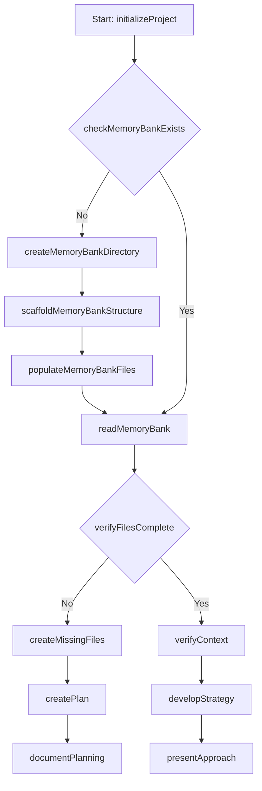
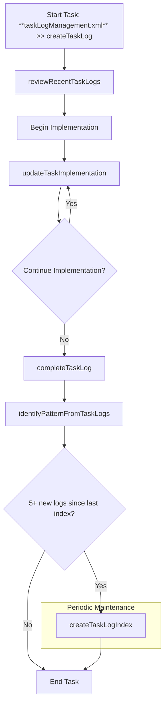

I am about to publish an entire new version if [the prompt](https://gist.github.com/entrepeneur4lyf/1dae24de42681c9a0d59d3a74a2eff4c). It signifies something I haven't seen anyone else doing. Creating a pseudo execution flow using an XML function map and order-of-operations workflows defined in XML that refer to nodes in a Mermaid diagram that also defines those flows and share "function" naming. So each node represents a function. 

I really want to credit [Nick Baumann w/ Cline Memory Bank](https://cline.bot/blog/memory-bank-how-to-make-cline-an-ai-agent-that-never-forgets) because that was really the catalyst to get me thinking about this whole thing. The discovery of using Mermaid Diagrams to control a workflow was a game changer.

The novel part is a feature of Windsurf. It is the Cascade Memory feature - which the models refer to as EPHEMERAL REMINDER. This acts like a cron with limits. If you notice that the models stops making task logs or following the workflow, you have to give it a manual reminder by telling it to remember to follow the "Windsurf Memory System" workflows. Sometimes it struggles if the codebase is large so you might havew to do that every few prompts.

You should see this happening -


I store the entire prompt (minus rules) in the "global rules" section. I put the rules in the "workspace rules" section.
Most of the time, I do not need to "intialize" the global rules prompt. However, if I see the model isn't responding, I will say "You need to intialize your Memory Bank with the "Windsurf Memory System" and that usually does the trick. Once it has run through the "initialize memory bank" workflow, Tell it to "Exercute Evaluation Phase" or literally just pass the function "createTaskLog()".

Examples:


Here is a quick example - the entire prompt will be posted in the repo and below. I will also post analysis from Grok 3, Claude 3.7 Sonnet Thinking and Bolt.new (I don't know which model that is).

It stats with a text prompt, but the engine is this:



## Workflow Phases

A workflow phase would refer to the different parts of a project evolution. For example, "Planning", "Documentation", etc.

I found that it helped to nto include all of the workflows that are repeated frequently in the "<WorkflowFunctions>Phasees</WorkflowFunctions>" beause, logically, logging isn't a "phase" per se. So I just created it's own functions, diagram flow and workflow (see bwlow).

```xml
<FunctionMap>
<!-- Workflow Phase Functions -->
  <WorkflowFunctions>
    <Phase name="Initialization">
      <Function id="initializeProject">Start the project planning process</Function>
      <Function id="checkMemoryBankExists">Verify if memory bank directory exists</Function>
      <Function id="createMemoryBankDirectory" condition="!memoryBankExists">Create the memory bank directory structure</Function>
      <Function id="scaffoldMemoryBankStructure" condition="!memoryBankExists">Create the initial structure for memory bank files</Function>
      <Function id="populateMemoryBankFiles" condition="!memoryBankExists">Populate memory bank files with initial content</Function>
      <Function id="readMemoryBank">Read all memory bank files to understand project context</Function>
      <Function id="initializeMemoryMap">Load function map into working memory</Function>
    </Phase>
  <!-- More Phases Below -->
  </WorkflowFunctions>

   <!-- Task Log Management Functions -->
  <TaskLogFunctions>
    <Function id="createTaskLog">Initialize a new task log with goal and timestamp</Function>
    <Function id="updateTaskImplementation">Document implementation details as work progresses</Function>
    <Function id="completeTaskLog">Finalize the log with completion time and performance score</Function>
    <Function id="reviewRecentTaskLogs">Examine recent logs to maintain context continuity</Function>
    <Function id="identifyPatternFromTaskLogs">Discover recurring patterns across multiple logs</Function>
    <Function id="createTaskLogIndex">Maintain a master index of all task logs with summaries</Function>
  </TaskLogFunctions>
</FunctionMap>

<!-- In addition, I use another xml structure to define the workflow as well and the "Step" informs the model that tthey are to step through it. It works like a charm. Anyway, this should give you a clear understanding of how all of these things are mapped together to create a reinforced workflow for the model to understand and follow.

<!-- Initialization Workflow -->
<Workflow id="initialization">
  <Step function="initializeProject"/>
  <Step function="checkMemoryBankExists"/>
  <Step function="createMemoryBankDirectory" condition="!memoryBankExists"/>
  <Step function="scaffoldMemoryBankStructure" condition="!memoryBankExists"/>
  <Step function="populateMemoryBankFiles" condition="!memoryBankExists"/>
  <Step function="readMemoryBank"/>
  <Step function="initializeMemoryMap"/>
</Workflow>

<!-- Task Log Management Workflow -->
<Workflow id="taskLogManagement">
  <Step function="createTaskLog"/>
  <Step function="updateTaskImplementation"/>
  <Step function="completeTaskLog"/>
  <Step function="reviewRecentTaskLogs"/>
  <Step function="identifyPatternFromTaskLogs"/>
  <Step function="createTaskLogIndex"/>
</Workflow>
```
NOTE: For different tools, you may find it useful to break these into separate files with an index tied to the Mermaid Diagram. It probably saves on token usage as well, I imagine. I did this with Bolt.new.

Example:


***

Here is what Bolt.new said whe I asked it what it thought of the framework.


***

### Here is what Grok 3 said. It is long because I asked for a "functional overview and detailed analysis".


***

## Overview of Windsurf and Its Memory System

Windsurf is an advanced coding assistant, developed by Codeium as a fork of Visual Studio Code (VSCode), designed to enhance coding with AI capabilities. It’s particularly noted for keeping developers in the flow state, available on Mac, Windows, and Linux ([Codeium Windsurf](https://codeium.com/windsurf)). A key feature is the Windsurf Memory System, which ensures continuity and high-quality output even when the AI’s memory resets between sessions.

The Memory Bank is a central repository of project information, stored in Markdown files like projectbrief.md for project scope and activeContext.md for current focus. It includes directories like .windsurf/plans/ for detailed plans and .windsurf/tasklogs/ for task logs, ensuring Windsurf can pick up where it left off. This system is crucial for maintaining context, especially given Windsurf’s memory resets.

### Role of Cascade Memories

Cascade Memories is a feature that provides quick access to critical context, acting as a summary of key workflows and decisions. It reduces the need to re-read the entire Memory Bank, enhancing efficiency. Users can trigger it to store or retrieve insights (e.g., create a memory of \[context\]), and it’s stored in a config path like ~/codeium/windsurf/, with updates logged for traceability ([Cascade Memories Docs](https://docs.codeium.com/windsurf/memories)).

### User-Created Meta Prompt

The user developed the Windsurf Memory Bank Meta Prompt by combining a Memory Bank prompt from Cline, created by

[@nickbaumann98](https://github.com/nickbaumann98)

on GitHub ([Cline Memory Bank](https://github.com/nickbaumann98/cline_docs/blob/main/prompting/custom%20instructions%20library/cline-memory-bank.md)), with their own designs. This integration ensures Windsurf benefits from a proven documentation system while adding unique enhancements like Cascade Memories.

### Workflows and Quality Assurance

Windsurf operates through structured workflows like Plan Mode for planning and Act Mode for execution, using functions defined in a Function Map. It emphasizes rigorous documentation, with task logs including goals, implementation details, and performance scores. A reward/penalty framework ensures optimized, bug-free code, with rules against placeholders and guessing, though effectiveness may vary by project complexity.

---

## Survey Note: Detailed Analysis of the Windsurf Memory System

### Introduction

Windsurf, developed by Codeium, is a fork of Visual Studio Code (VSCode), launched as an AI agent-powered IDE to keep developers in the flow state. It’s available on multiple platforms, with features like deep codebase understanding and real-time action awareness, as noted in recent updates ([Codeium Windsurf](https://codeium.com/windsurf)). This survey note explores the Windsurf Memory System, its components, and its origins, particularly focusing on the user’s custom meta-prompt and the role of Cascade Memories.

### Background and Origins

Windsurf’s development by Codeium, a $1.25 billion AI startup, aims to combine AI coding “copilots” and “agents,” as highlighted in recent industry coverage ([Forbes on Windsurf](https://www.forbes.com/sites/richardnieva/2024/11/13/codeium-windsurf/)). The user, leveraging their expertise, created the Windsurf Memory Bank Meta Prompt by combining a Memory Bank prompt from Cline, an AI coding assistant, developed by

[@nickbaumann98](https://github.com/nickbaumann98)

on GitHub ([Cline Memory Bank](https://github.com/nickbaumann98/cline_docs/blob/main/prompting/custom%20instructions%20library/cline-memory-bank.md)). This Cline prompt transforms the AI into a self-documenting system with memory resets, using Markdown files for context tracking. The user’s additions include enhancements like utlilizing Cascade Memories, tailored to Windsurf’s capabilities.

### Memory Bank Structure and Function

The Memory Bank is the backbone of Windsurf’s continuity, comprising required core files and additional directories. The core files include:

| File Name            | Purpose                                      | Creation Function          |
|----------------------|----------------------------------------------|----------------------------|
| projectbrief.md      | Defines project scope, goals, requirements   | createProjectBrief         |
| productContext.md    | Explains project purpose, problems solved    | createProductContext       |
| systemPatterns.md    | Details system architecture, design patterns | createSystemPatterns       |
| techContext.md       | Lists technologies, setup, dependencies      | createTechContext          |
| activeContext.md     | Tracks current focus, recent changes, steps  | createActiveContext        |
| progress.md          | Summarizes built features, pending tasks     | createProgressDoc          |

These files form a hierarchy, with projectbrief.md as the foundation, feeding into productContext.md, systemPatterns.md, and techContext.md, which then inform activeContext.md and progress.md. Additional directories include .windsurf/plans/ for detailed plans (e.g., UI/UX, database schemas) and .windsurf/tasklogs/ for task logs, formatted with GOAL, IMPLEMENTATION, COMPLETED, PERFORMANCE, and NEXT\_STEPS.

At startup, Windsurf checks if the Memory Bank exists, scaffolds it if needed, and reads all files to regain context. This ensures continuity, especially critical given Windsurf’s memory resets, as noted in community discussions ([Reddit on Windsurf](https://www.reddit.com/r/Codeium/comments/1iw0qnq/i_feel_windsurf_is_underrated_it_deserves_more/)).

### Cascade Memories: Enhancing Efficiency

Cascade Memories, a feature of Windsurf, provides quick access to critical context, reducing the need to re-read the entire Memory Bank. It’s part of Windsurf’s Cascade system, which offers deep codebase understanding and real-time action awareness ([Cascade Docs](https://docs.codeium.com/windsurf/cascade)). Users can trigger it to store or retrieve insights (e.g., create a memory of \[context\]), and it’s stored in a config path like ~/codeium/windsurf/, with updates logged for traceability ([Cascade Memories Docs](https://docs.codeium.com/windsurf/memories)). This feature, automatically generating memories to retain context between conversations, was introduced in recent updates ([Windsurf Changelogs](https://codeium.com/changelog)).

Cascade Memories act as a “cheat sheet,” reminding Windsurf of key workflows and decisions, enhancing efficiency. For example, before a task, Windsurf checks Cascade Memories for prior context; if missing, it reads the Memory Bank and creates a new memory, ensuring seamless operation.

### Workflows and Operational Mechanics

Windsurf operates through structured workflows, defined in a Function Map loaded at startup. These include:

*   **Plan Mode**: Initializes the Memory Bank, verifies files, creates plans, and presents strategies (e.g., checkMemoryBankExists, createPlan, presentApproach).
    
*   **Act Mode**: Executes tasks, updates documentation, and logs progress (e.g., executeTask, updateDocumentation, documentChanges).
    
*   **Documentation Mode**: Maintains records, reviewing files and clarifying next steps (e.g., updateMemoryBank, reviewAllFiles).
    
*   **Learning Process**: Identifies patterns, validates with the user, and applies them to improve work (e.g., discoverNewPattern, applyLearnedPatterns).

Task execution begins with creating a task log, updating it during implementation, and finalizing with performance scores. Periodic indexing ensures easy access to past logs, with documentation updates synced to both Memory Bank and Cascade Memories.

### Quality Assurance and User Experience

Windsurf adheres to strict rules, including no placeholders, fully functional code, and read-before-edit policies, enforced by a reward/penalty framework. Rewards include +10 for optimal big-O efficiency, while penalties include -10 for bugs, ensuring optimized, readable code ([Windsurf Rules](https://docs.codeium.com/windsurf/memories)). This system, while effective, may vary by project complexity, as noted in community feedback ([Reddit on Windsurf](https://www.reddit.com/r/Codeium/comments/1gwz0sd/my_experience_with_windsurf_editor_with_cascade/)).

The user’s custom meta-prompt, integrating Cline’s Memory Bank concept, ensures Windsurf benefits from a proven system while adding Cascade Memories for efficiency. This combination, tailored to Windsurf’s agentic IDE capabilities, supports high-quality software development, even with memory resets.

### Conclusion

The Windsurf Memory System, with its Memory Bank and Cascade Memories, provides a robust framework for maintaining project continuity and ensuring high-quality software development. Its origins, combining Cline’s Memory Bank prompt with user-designed enhancements, highlight its adaptability and effectiveness, particularly for AI with memory resets.


***

### Grok 3 suggested it provide a detailed walkthrough of how the framework functions

***

## Understanding the Meta Prompt

The Meta Prompt for Windsurf, an AI coding assistant developed by Codeium as a fork of VSCode, is a comprehensive system designed to maintain project continuity despite memory resets. It integrates a Memory Bank for persistent storage, Cascade Memories for quick context recall, and structured workflows for task execution. This analysis explores how the workflows, FunctionMap, WorkFlow XML, and Mermaid diagrams interact to create a pseudo execution order, akin to a program's execution flow.

## Workflows and Their Structure

The Meta Prompt defines several workflows, each corresponding to a project phase:

*   **Initialization**: Sets up the Memory Bank, checks its existence, and loads context.
    
*   **Planning**: Verifies files, creates plans, and develops strategies.
    
*   **Implementation**: Executes tasks, updates documentation, and ensures code quality.
    
*   **Documentation**: Maintains records in the Memory Bank and task logs.
    
*   **Evaluation**: Assesses performance against criteria.
    
*   **Learning**: Identifies patterns and applies insights.
    
*   **Task Log Management**: Maintains logs for continuity.
    
*   **Error Handling**: Manages tool failures with retries and escalations.

Each workflow is a sequence of steps, with functions called in order, similar to a program's control flow. For instance, Initialization starts with `initializeProject`, then checks `checkMemoryBankExists`, and scaffolds if needed, mirroring a setup routine.

## FunctionMap and WorkFlow XML

The FunctionMap, defined in XML, catalogs all functions by phase, such as Structure Functions (`createProjectBrief`), Workflow Functions (e.g., `executeTask` under Implementation), and Task Log Functions (`createTaskLog`). It acts as a library of subroutines.

The WorkFlow XML specifies the execution order for each workflow, with steps that call functions or other workflows based on conditions. For example, the Initialization workflow includes:

*   Step: `initializeProject`
    
*   Step: `checkMemoryBankExists`
    
*   Step (if condition `!memoryBankExists`): `createMemoryBankDirectory`
    
*   Step: `readMemoryBank`

This conditional logic is like if-else statements, deciding the next function based on the current state, creating a deterministic flow.

## Mermaid Diagrams and Visualization

Mermaid diagrams, provided in the Meta Prompt, visualize these workflows, showing function dependencies and flow. For example, the Plan Mode flowchart shows:

*   Start → Check Memory Bank → Create Directory (if needed) → Scaffold Structure → Read Files → Verify Files → Create Missing (if needed) → Plan → Document.

These diagrams aid in understanding the sequence, making the pseudo execution order intuitive, like a flowchart in programming.

## Interaction and Pseudo Execution Order

The interaction creates a pseudo execution order:

1.  **Startup**: Windsurf runs the Initialization workflow, setting up the Memory Bank and loading the FunctionMap.
    
2.  **Task Execution**: Depending on the task, it enters Planning (e.g., `createPlan`), then Implementation (e.g., `executeTask`), updating the Memory Bank and Cascade Memories for efficiency.
    
3.  **Documentation and Evaluation**: Post-task, it updates logs and evaluates performance, ensuring continuity.
    
4.  **Learning and Error Handling**: Identifies patterns or handles failures, adapting based on conditions.

This flow is program-like, with workflows as main routines, functions as subroutines, and the Memory Bank as the data store. Cascade Memories optimize access, reducing read times, enhancing efficiency.

## Memory Bank and Cascade Memories

The Memory Bank, with files like `projectbrief.md` and `progress.md`, is the persistent state, read and written by functions. Cascade Memories, a cache, store key insights (e.g., `create a memory of [context]`), reducing the need to re-read the entire bank, making the system adaptive and efficient.

## Example Flow

For a feature implementation:

*   Windsurf checks Cascade Memories for context, then reads `activeContext.md`.
    
*   Enters Planning: Verifies files, creates a plan in `.windsurf/plans/`.
    
*   Moves to Implementation: Executes `executeTask`, updates `progress.md`, and logs in task logs.
    
*   If a tool fails, triggers Error Handling, retrying or escalating.

This structured flow ensures consistency, with workflows dictating the order, FunctionMap providing functions, and diagrams visualizing the process.

---

## Survey Note: Detailed Analysis of the Windsurf Meta Prompt

### Introduction

Windsurf, developed by Codeium, is a fork of Visual Studio Code (VSCode), launched as an AI agent-powered IDE to keep developers in the flow state, available on Mac, Windows, and Linux ([Codeium Windsurf](https://codeium.com/windsurf)). This survey note explores the Windsurf Memory System, focusing on the Meta Prompt's components—workflows, FunctionMap, WorkFlow XML, and Mermaid diagrams—and how they interact to create a pseudo execution order, akin to a program's flow.

### Background and Origins

Windsurf’s development by Codeium, a $1.25 billion AI startup, aims to combine AI coding “copilots” and “agents,” as highlighted in recent industry coverage ([Forbes on Windsurf](https://www.forbes.com/sites/richardnieva/2024/11/13/codeium-windsurf/)). The user created the Meta Prompt by combining a Memory Bank prompt from Cline, developed by

[@nickbaumann98](https://github.com/nickbaumann98)

on GitHub ([Cline Memory Bank](https://github.com/nickbaumann98/cline_docs/blob/main/prompting/custom%20instructions%20library/cline-memory-bank.md)), with their own designs, enhancing continuity for memory resets.

### Memory Bank Structure and Function

The Memory Bank is the backbone of Windsurf’s continuity, comprising required core files and additional directories. The core files include:

| File Name            | Purpose                                      | Creation Function          |
|----------------------|----------------------------------------------|----------------------------|
| projectbrief.md      | Defines project scope, goals, requirements   | createProjectBrief         |
| productContext.md    | Explains project purpose, problems solved    | createProductContext       |
| systemPatterns.md    | Details system architecture, design patterns | createSystemPatterns       |
| techContext.md       | Lists technologies, setup, dependencies      | createTechContext          |
| activeContext.md     | Tracks current focus, recent changes, steps  | createActiveContext        |
| progress.md          | Summarizes built features, pending tasks     | createProgressDoc          |

These files form a hierarchy, with `projectbrief.md` as the foundation, feeding into others, and are read and updated by functions, ensuring context across resets.

### Cascade Memories: Enhancing Efficiency

Cascade Memories, part of Windsurf’s Cascade system, provide quick access to critical context, reducing read times ([Cascade Memories Docs](https://docs.codeium.com/windsurf/memories)). Users trigger it to store or retrieve insights (e.g., `create a memory of [context]`), stored in `~/codeium/windsurf/`, with updates logged for traceability. This feature, introduced in recent updates ([Windsurf Changelogs](https://codeium.com/changelog)), acts as a cache, optimizing efficiency.

### Workflows and Operational Mechanics

Windsurf operates through structured workflows, defined in WorkFlow XML, with sequences of function calls from the FunctionMap. Key workflows include:

*   **Initialization Workflow**:
    
    *   Steps: `initializeProject` → `checkMemoryBankExists` → (if `!memoryBankExists`, `createMemoryBankDirectory`, `scaffoldMemoryBankStructure`) → `readMemoryBank` → `initializeMemoryMap`.
        
*   **Planning Workflow**:
    
    *   Steps: `verifyFilesComplete` → (if `!filesComplete`, `createMissingFiles`) → `analyzeProblem` → `createPlan` → `documentPlanning` → `verifyContext` → `developStrategy` → `presentApproach`.
        
*   **Implementation Workflow**:
    
    *   Steps: `executeTask` → `checkMemoryBank` → `updateDocumentation` → `updatePlans` → `executeImplementation` → `enforceCodeQualityStandards` → `executeCreatorPhase` → `executeCriticPhase` → `executeDefenderPhase` → `executeJudgePhase`.

These workflows, visualized in Mermaid diagrams, show function dependencies, like Plan Mode starting with checking the Memory Bank and scaffolding if needed, ensuring a clear execution order.

### FunctionMap and Its Role

The FunctionMap, an XML document, organizes functions by phase:

*   **Structure Functions**: `createProjectBrief`, `createProductContext`, etc.
    
*   **Workflow Functions**: Grouped by phases like Initialization (`initializeProject`), Implementation (`executeTask`).
    
*   **Learning Functions**: `discoverNewPattern`, `applyLearnedPatterns`.
    
*   **Task Log Functions**: `createTaskLog`, `completeTaskLog`.

It acts as a library, with WorkFlow XML calling these functions in sequence, creating a program-like flow with conditional logic (e.g., `condition="!memoryBankExists"`).

### Mermaid Diagrams and Visualization

Mermaid diagrams, such as the Plan Mode flowchart, visualize workflows, showing:

*   Start → Check Memory Bank → Create Directory (if needed) → Scaffold Structure → Read Files → Verify Files → Create Missing (if needed) → Plan → Document.

These diagrams aid in understanding the pseudo execution order, making the system intuitive, like flowcharts in programming.

### Interaction and Pseudo Execution Order

The interaction creates a program-like flow:

*   At startup, Windsurf runs Initialization, setting up the Memory Bank and loading the FunctionMap.
    
*   For tasks, it enters Planning, then Implementation, updating the Memory Bank and Cascade Memories.
    
*   Post-task, it documents changes, evaluates performance, and learns patterns, with Error Handling for failures.

This flow is deterministic, with workflows as main routines, functions as subroutines, and the Memory Bank as the data store. Cascade Memories optimize access, reducing read times, enhancing efficiency.

### Example Flow and Adaptability

For a feature implementation:

*   Checks Cascade Memories, reads `activeContext.md`.
    
*   Enters Planning: Verifies files, creates a plan in `.windsurf/plans/`.
    
*   Moves to Implementation: Executes `executeTask`, updates `progress.md`, logs in task logs.
    
*   If a tool fails, triggers Error Handling, retrying or escalating.

This structured flow ensures consistency, with workflows dictating the order, FunctionMap providing functions, and diagrams visualizing the process.

### Quality Assurance and User Experience

Windsurf adheres to strict rules, including no placeholders, fully functional code, and read-before-edit policies, enforced by a reward/penalty framework ([Windsurf Rules](https://docs.codeium.com/windsurf/memories)). This system, while effective, may vary by project complexity, as noted in community feedback ([Reddit on Windsurf](https://www.reddit.com/r/Codeium/comments/1gwz0sd/my_experience_with_windsurf_editor_with_cascade/)).

### Conclusion

The Meta Prompt defines a detailed, structured system for software development, resembling a programmed workflow, with clear steps, functions, and data management, making it highly effective for an AI with memory resets.
