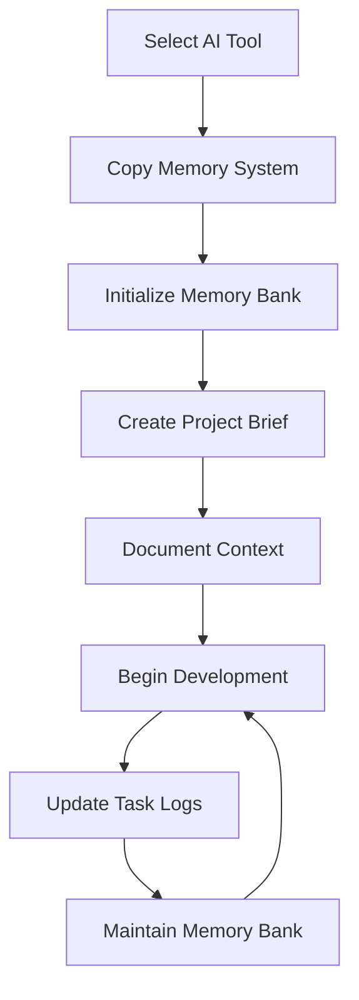

# AI Coding Assistant Memory Systems

A collection of memory systems and meta-workflow frameworks for various AI coding assistants, enabling continuity across sessions and structured project documentation.

## Overview

This repository provides specialized memory systems for different AI coding assistants, helping them maintain context and project understanding across multiple sessions. Each memory system is tailored to the specific capabilities and interface of its target AI tool.

## Memory System Architecture

Each memory system follows a similar architecture, based on the Windsurf Memory Framework:

1. **Memory Bank**: Structured documentation files with hierarchical relationships
2. **Task Logs**: Implementation records with performance evaluations
3. **Function Maps**: Method definitions with relationships (XML or JSON based)
4. **Self-Critique Cycle**: Four-phase improvement process

## Supported AI Coding Assistants

| Assistant | Description | Status |
|-----------|-------------|--------|
| [Windsurf](./windsurf/) | The original memory system framework | ✅ Complete |
| [Cline](./Cline/) | Adaptation for Anthropic's Claude in VSCode | ✅ Complete |
| [ClaudeCode](./ClaudeCode/) | Adaptation for Anthropic's Claude Code | ✅ Complete |
| [Cursor](./Cursor/) | Adaptation for Cursor AI | ✅ Complete |
| [Zed](./Zed/) | Adaptation for Zed AI | ✅ Complete |
| [Continue](./Continue/) | Adaptation for Continue.dev | ✅ Complete |
| [Cody](./Cody/) | Adaptation for Sourcegraph's Cody | ✅ Complete |
| [RooCode](./RooCode/) | Adaptation for RooCode AI | ✅ Complete |

## Project Documentation Framework

The repository also includes a comprehensive [Project Documentation Templates](./project_documentation_templates/) framework that integrates with the memory systems:

- Project overview, features, and requirements templates
- Tech stack and dependencies documentation templates
- User flow and implementation documentation
- Project structure documentation
- Meta-workflow integration guides

## Getting Started

1. Select the memory system for your preferred AI coding assistant
2. Copy the memory system files to your project
3. Initialize the memory bank structure
4. Begin documenting your project following the memory system's workflows

## Integration Process

## Special Thanks
I want to thank [Cline](https://github.com/nickbaumann98/cline_docs/blob/main/prompting/custom%20instructions%20library/cline-memory-bank.md) and [@nickbaumann98](https://github.com/nickbaumann98) for inspiration from the Cline Memory Bank prompt. You are the GOATs.

## Contributing

Contributions are welcome! If you'd like to add support for another AI coding assistant or improve an existing memory system, please submit a pull request.

## License

This project is licensed under the Apache License 2.0 - see the [LICENSE](LICENSE) file for details.
