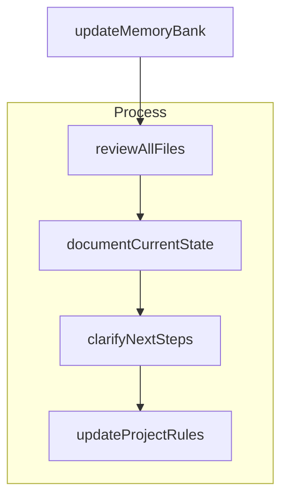

### Documentation Update Process - Fixed


### Project Learning Functions - Fixed
```mermaid
flowchart TD
    Start{discoverNewPattern} --> D1[identifyPattern]
    
    subgraph Learn [learningProcess]
        D1 --> D2[validateWithUser]
        D2 --> D3[documentInTaskLogs]
    end
    
    D3 --> A1[readTaskLogs]
    
    subgraph Apply [applyLearning]
        A1 --> A2[applyLearnedPatterns]
        A2 --> A3[improveFutureWork]
    end
