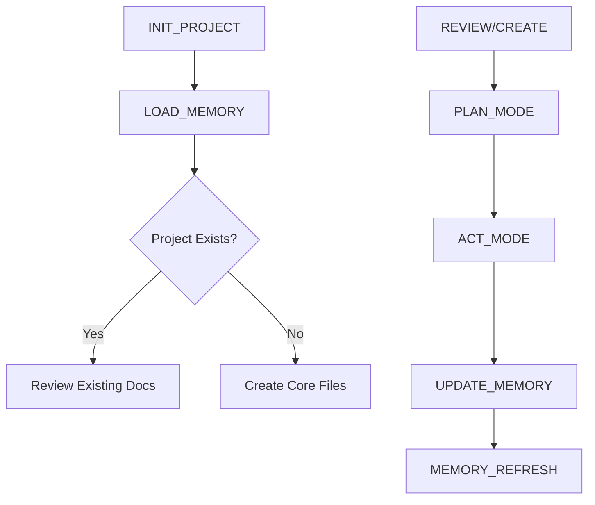
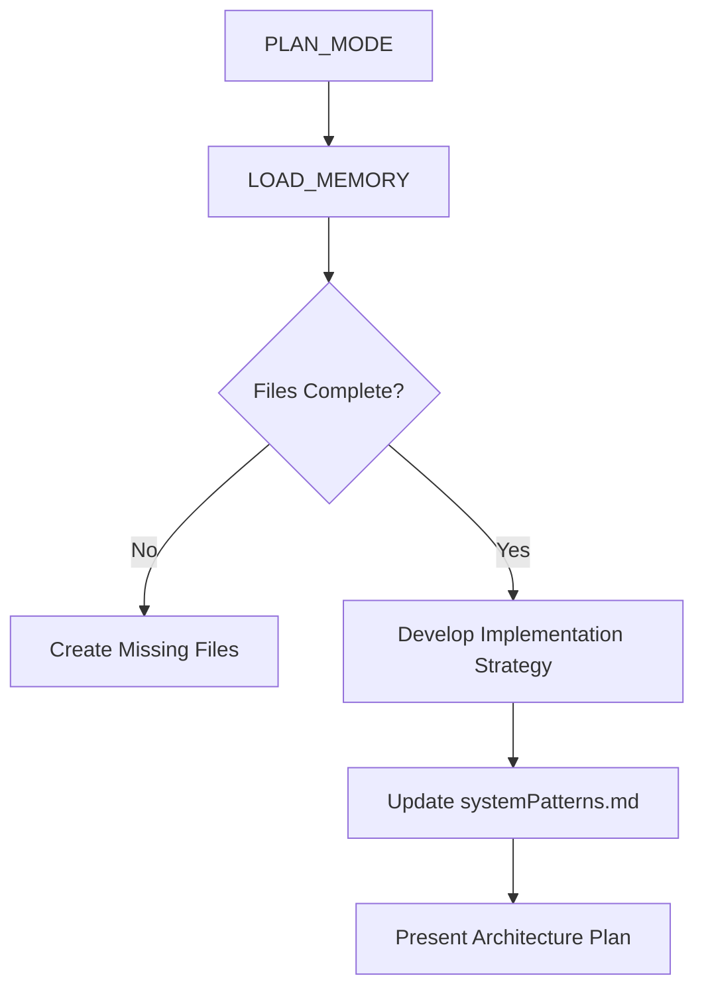
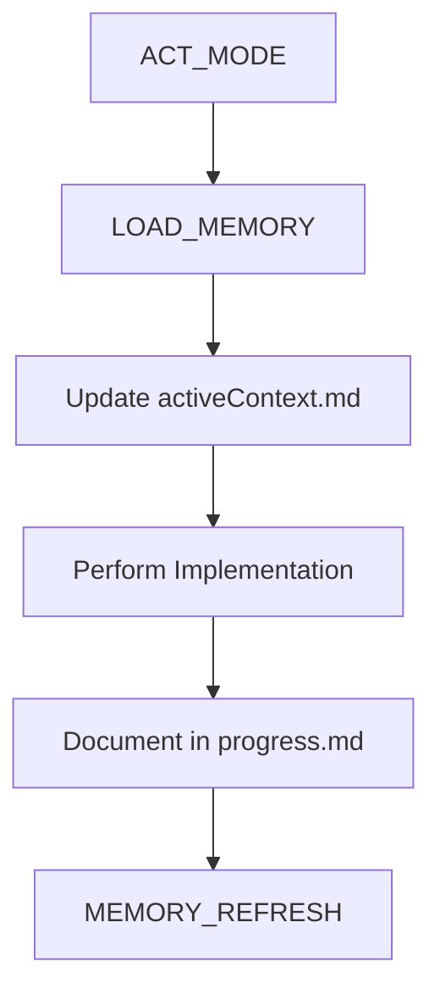
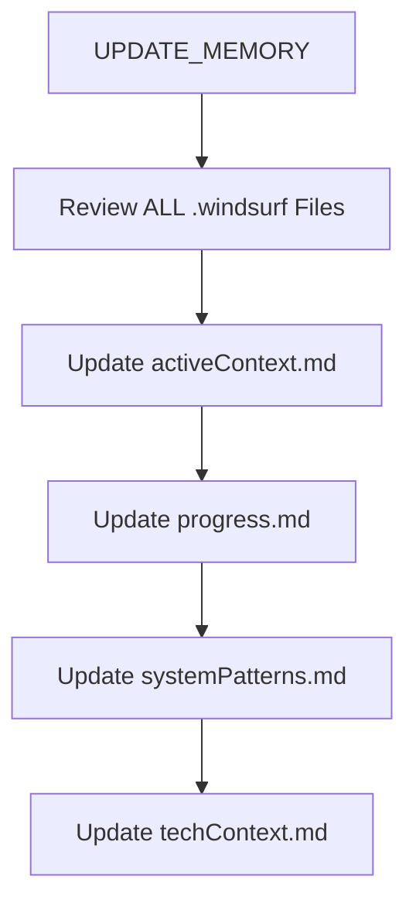

```markdown
# Windsurf Coding Assistant Workflow v2.0

**Memory-Driven Development Protocol**

## Core Methods (Keyword-Triggered)

1. `INIT_PROJECT` - Initialize project structure
2. `LOAD_MEMORY` - Read all .windsurf files
3. `PLAN_MODE` - Architectural planning workflow
4. `ACT_MODE` - Implementation workflow
5. `UPDATE_MEMORY` - Documentation maintenance
6. `CRITIQUE_CYCLE` - Adversarial improvement process
7. `MEMORY_REFRESH` - Full context reload



## Method Implementation Guide

### `INIT_PROJECT`
- Create .windsurf directory structure
- Generate initial core files if missing:
  ```python
  .windsurf/
  ├── plans/
  │   ├── projectbrief.md
  │   ├── productContext.md
  │   └── systemPatterns.md
  └── context/
      ├── techContext.md
      └── progress.md
  ```

### `LOAD_MEMORY` (Automatic)
- **Required at start of every interaction**
- Read all .md files in .windsurf directory
- Validate file relationships:
  ```mermaid
  flowchart LR
    projectbrief.md --> productContext.md
    projectbrief.md --> systemPatterns.md
    productContext.md --> activeContext.md
    systemPatterns.md --> activeContext.md
  ```

### `PLAN_MODE` Workflow


### `ACT_MODE` Workflow


### `UPDATE_MEMORY` Protocol
Triggered when:
1. New patterns discovered
2. Major changes implemented
3. User command: **update memory bank**
4. Context clarification needed



## Execution Guidelines

1. **Always start with** `LOAD_MEMORY`
2. **For new projects**:
   ```python
   INIT_PROJECT() 
   PLAN_MODE()
   ```
3. **For existing projects**:
   ```python
   LOAD_MEMORY()
   ACT_MODE()
   ```
4. **After major changes**:
   ```python
   UPDATE_MEMORY()
   MEMORY_REFRESH()
   ```

## Required Documentation Standards

### Core Files
| File | Purpose | Update Trigger |
|------|---------|----------------|
| projectbrief.md | Foundational requirements | Project start |
| productContext.md | User goals & problems | Scope changes |
| systemPatterns.md | Architectural decisions | Design changes |
| techContext.md | Technical stack details | Dependency updates |
| activeContext.md | Current work state | Task start/end |
| progress.md | Implementation status | Task completion |

### Context Files (Optional)
- Create in `.windsurf/context/` when needed:
  - `apiSpecs.md`
  - `testingStrategy.md`
  - `deploymentProcess.md`

## Critical Behaviors
- **Never proceed** without complete Memory Bank
- **Always verify** file relationships
- **Document all decisions** in markdown
- **Use versioned updates** for critical changes
- **Maintain clear audit trails** in progress.md

## Example Interaction Flow
```python
LOAD_MEMORY()
if project_exists:
    ACT_MODE()
else:
    INIT_PROJECT()
    PLAN_MODE()
UPDATE_MEMORY()
MEMORY_REFRESH()
```

**Note:** When encountering uncertainty, default to creating new documentation rather than assuming context. All technical decisions must be traceable through Memory Bank entries.
```
