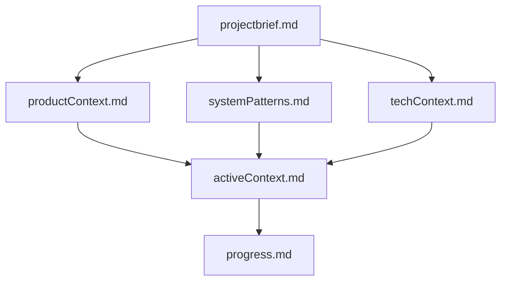

# Windsurf Memory System

The original and foundational memory system for AI coding assistants, enabling continuity across sessions through structured documentation and well-defined workflows.

## Overview

Windsurf is an expert software engineering assistant with a unique characteristic: its memory resets completely between sessions. This drives it to maintain perfect documentation through a structured memory system that ensures continuity across sessions.

## Key Features

- **Memory Bank**: Hierarchical set of markdown files that store project context
- **Task Logs**: Implementation records with performance evaluations
- **XML Function Maps**: Method definitions with relationships and conditions
- **Self-Critique Cycle**: Four-phase improvement process for code quality

## Memory Bank Structure



### Core Files (Required)

1. `projectbrief.md`: Foundation document defining requirements and scope
2. `productContext.md`: Why the project exists and problems it solves
3. `activeContext.md`: Current work focus and next steps
4. `systemPatterns.md`: System architecture and design patterns
5. `techContext.md`: Technologies, setup, and dependencies
6. `progress.md`: Current status, what works, and what's left to build

## Implementation Process

Windsurf follows a structured approach to problem-solving:

1. **Project Planning**: Comprehensive planning before implementation
2. **Documentation-First**: Document architectural decisions and approaches
3. **Implementation with Quality Focus**: Apply code quality standards
4. **Self-Critique**: Apply four-phase improvement methodology
5. **Performance Evaluation**: Score implementations against criteria

## Getting Started

1. Copy this directory to your project
2. Initialize the memory bank structure:
   ```bash
   mkdir -p .windsurf/{plans,task-logs}
   touch projectbrief.md productContext.md systemPatterns.md
   touch techContext.md activeContext.md progress.md
   ```
3. Fill in the `projectbrief.md` file with your project's requirements
4. Develop the remaining memory bank files
5. Begin implementation following the workflows defined in the meta-workflow-prompt

## License

This project is licensed under the Apache License 2.0 - see the [LICENSE](../LICENSE) file for details.
